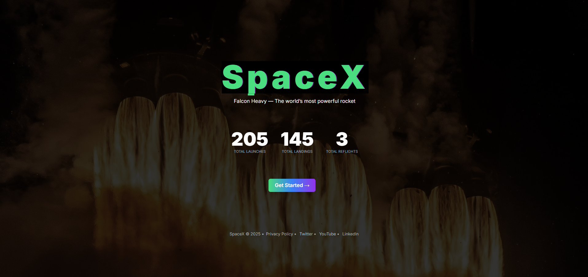

<div align="center">
  <br />
  
  <br />
  <!-- Tech Stack Badges -->
  <div>
    
    
    
    
    
  </div>

  <h3 align="center">🚀 SpaceX Launch Dashboard</h3>

  <div align="center">
    A modern and responsive dashboard that displays upcoming, past, and latest SpaceX launches with filtering, animations, and live mission data.
  </div>

  <br />
<div align="center">
  🌐 <strong>Live Demo</strong>: <a href="https://karthickramalagar.github.io/interview-for-Karthickramalagar/">SpaceX Dashboard</a>
</div>


  <br />

  <!-- Personal Links -->
  <div align="center">
    <a href="https://github.com/karthickramalagar">
      
    </a>
    <a href="https://linkedin.com/in/karthickramalagar">
      
    </a>
    <a href="mailto:karthickramalagar@gmail.com">
      
    </a>
  </div>
</div>

---

## 📋 Table of Contents

1. [Introduction](#-introduction)  
2. [Tech Stack](#-tech-stack)  
3. [Features](#-features)  
4. [Quick Start](#-quick-start)  
5. [Installation](#-installation)  
6. [License](#-license)  
7. [Acknowledgements](#-acknowledgements)  

---

## 🚀 Introduction

The **SpaceX Launch Dashboard** is a modern frontend web app built with React, Vite, MUI, and Tailwind CSS.  
It fetches real-time data from the SpaceX public API and visualizes mission data in a clean and animated UI.  
Users can explore past, upcoming, and the latest launches with advanced filtering, pagination, and detailed modal views.

---

## 🔧 Tech Stack

- ⚡ **Vite** — Lightning-fast build tool  
- ⚛ **React.js** — Component-based UI library  
- 🎨 **MUI (Material UI)** — UI components with accessibility  
- 💨 **Tailwind CSS** — Utility-first CSS framework  
- 🎞 **Framer Motion** — Animations and transitions  
- 📅 **dayjs** — Date formatting  
- 🛰️ **SpaceX API** — Real-time launch data

---

## ⚙ Features

- ✅ **Launch Table UI**: Filter by past, upcoming, latest, success, failure  
- 📆 **Dynamic Date Filtering**: Choose exact date range  
- 🔍 **Launch Details Modal**: Mission, rocket, media, payload info  
- 🟢 **Status Tag**: Success, Failed, Upcoming  
- 📱 **Responsive Design**: Mobile & desktop friendly  
- 🔗 **API-Driven**: Real-time SpaceX launch data

---

## ⚡ Quick Start

### Prerequisites

- Node.js  
- npm

### Clone the Repository

```bash
git clone https://github.com/karthickramalagar/spacex-dashboard.git
cd spacex-dashboard
```
Install & Run
```
npm install
npm run dev
```
📄 License
This project is licensed under the MIT License — see the LICENSE file for details.

🙏 Acknowledgements
SpaceX API

React

Vite

MUI

Tailwind CSS

Framer Motion

dayjs
